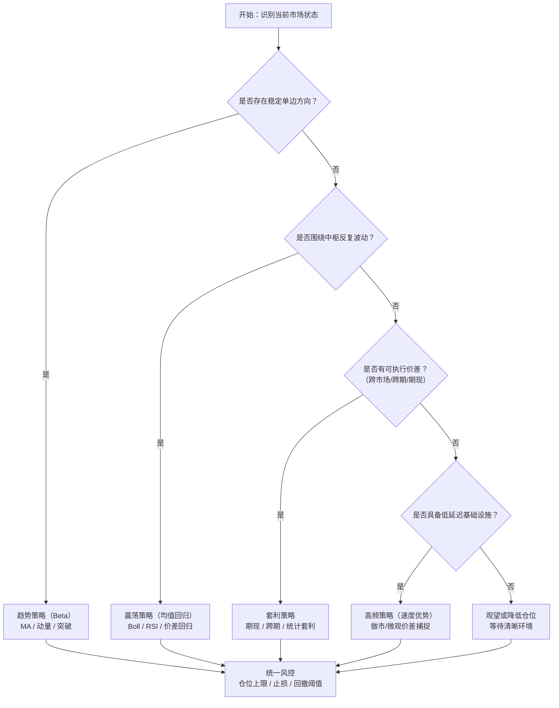

# AI量化-量化基础

## 什么是量化交易？

量化是将投资逻辑数据化、模型化、程序化，以实现可验证、可复现和可迭代的交易决策方法。

用**数据 + 数学模型 + 程序**来做投资决策，而不是只靠主观判断。

更具体地说，量化通常包括：

- 把市场信息转成可计算的数据（价格、成交量、财务、新闻等）
- 定义可执行的规则或模型（何时买、何时卖、仓位多少）
- 用程序自动回测、评估和执行
- 用风险控制规则限制回撤和单一风险暴露

> [!NOTE]
>
> 量化本质上是一套工具链，而不是收益保证。它能放大纪律与优势，也会放大认知偏差与系统缺陷。量化能否发挥正向价值，取决于交易系统是否完整：是否有可持续的逻辑、严格的风险控制、稳定的执行机制与持续迭代能力。
## 量化交易的优点和缺点

### 优点

- 纪律性强：按规则执行，减少情绪化交易。
- 可回测验证：能在历史数据上检验策略有效性。
- 可复现可迭代：策略逻辑明确，便于优化和版本管理。
- 处理能力强：可同时跟踪多市场、多标的、多因子。
- 执行效率高：自动化下单更快，能捕捉短时机会。
- 风控可程序化：止损、仓位、敞口约束可统一执行。

### 缺点

- 过拟合风险：历史上有效不代表未来有效。
- 数据与模型偏差：脏数据、幸存者偏差、未来函数会误导结果。
- 市场会变化：策略可能因风格切换而失效。
- 黑箱化问题：复杂模型可解释性弱，排错困难。
- 技术与运维风险：程序 bug、网络/交易接口故障会带来损失。
- 成本侵蚀收益：滑点、手续费、冲击成本可能吃掉利润。
- 黑天鹅风险：极端行情下模型可能失效。
- 同质化风险：策略趋同可能导致拥挤交易。
- 滞后性：对突发事件与结构性变化反应较慢。

## 你想赚什么钱？

AI 量化在实战里，首先要回答一个问题：你到底在赚哪一类钱。不同收益来源对应不同市场状态、策略逻辑和风险暴露。

### 趋势（Beta）

- 核心逻辑：市场在一段时间内沿某个方向持续运动，本质是市场共识的强化。
- 交易方式：不追求抄最低、卖最高，强调“确认趋势后跟随，趋势破坏就退出”。
- 量化实现：均线交叉（MA）、动量因子（Momentum）、突破策略。
- AI 作用：盯趋势、盯信号，减少人性里的“恐高不敢买、贪婪不肯卖”。

### 震荡（均值回归）

- 核心逻辑：价格围绕价值中枢上下波动，偏离后倾向回归。
- 交易方式：逢低吸纳、逢高减仓（高抛低吸）。
- 量化实现：Bollinger Bands、RSI 超买超卖、价差回归模型。
- AI 作用：24 小时盯小价差、执行重复性高频次决策。
- 主要风险：在单边趋势中逆势加仓，可能导致连续亏损。

### 套利（无风险/低风险）

- 核心逻辑：同一资产在不同市场/维度出现定价差。
- 收益来源：不是押涨跌，而是赚“价差收敛”。
- 常见形态：期现套利、跨期套利、统计套利、ETF 折溢价套利。
- AI 作用：机会稍纵即逝，程序可瞬时发现并执行价差交易。

### 高频（速度优势）

- 核心逻辑：通过更低延迟捕捉微小买卖价差。
- 收益来源：微观结构中的速度溢价与流动性价差。
- 实战特点：基础设施和工程门槛极高，竞争激烈。
- 适用提醒：更偏机构化赛道，普通投资者应谨慎参与。

### 常见误区

- 用震荡策略去扛单边趋势。
- 用趋势思维去死扛震荡行情。

### 实战结论

AI 量化的第一步，不是先上模型复杂度，而是先识别当前市场状态（趋势、震荡、套利窗口或高频环境），再匹配对应策略与风控。

### 策略选择流程图（按市场状态）

使用建议：先判市场，再选策略；不要用一个策略硬套所有行情。

## 你在赚什么钱？

把策略名称换成“收益来源”视角，会更容易做研究复盘与风险归因。常见可扩展为以下 8 类：

| 收益来源 | 本质在赚什么 | 适用行情 | 核心风险 | 常用指标/信号 |
| --- | --- | --- | --- | --- |
| 方向钱（趋势/Beta） | 赚市场持续单边运动的钱 | 趋势明确、共识强化 | 趋势反转、假突破 | MA、ADX、动量、突破强度 |
| 回归钱（均值回归） | 赚偏离中枢后的回归 | 震荡、无明确主升主跌 | 单边行情中逆势亏损 | Boll、RSI、Z-Score、偏离率 |
| 价差钱（套利） | 赚错价收敛的钱 | 价差可交易、摩擦成本可控 | 收敛失败、成本吞噬 | 基差、价差分位、协整检验 |
| 速度钱（高频） | 赚微观结构与执行速度优势 | 高频成交、盘口活跃 | 技术故障、竞争挤压 | 延迟、成交率、滑点、订单簿不平衡 |
| 事件钱（事件驱动） | 赚信息冲击后的重定价 | 财报、并购、政策、调仓窗口 | 事件不及预期、跳空风险 | 事件日历、异常收益、公告情绪 |
| 波动钱（波动率） | 赚隐含与实现波动的差异 | 波动率可预测或显著偏离 | 波动跳升、Gamma/Vega 风险 | IV-RV 差、VIX、波动率分位 |
| 流动性钱（做市/流动性补偿） | 赚提供流动性的补偿 | 盘口深度可持续、双边成交稳定 | 单边踩踏、库存风险 | Bid-Ask、库存暴露、撤单率 |
| 结构钱（期限/风格/跨资产） | 赚结构性错配和轮动 | 风格切换、期限结构异常 | 结构长期失效、拥挤交易 | 期限价差、风格因子、相关性裂变 |

实战建议：每个策略都要先写清“我赚的是哪类钱”，再定义“何时失效、如何止损、何时降杠杆”。
